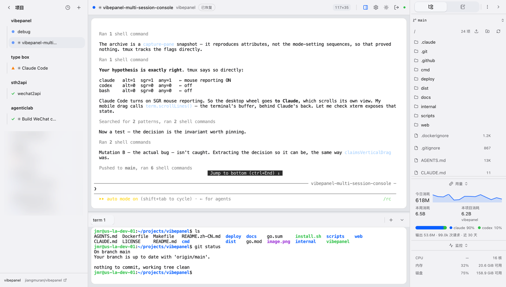
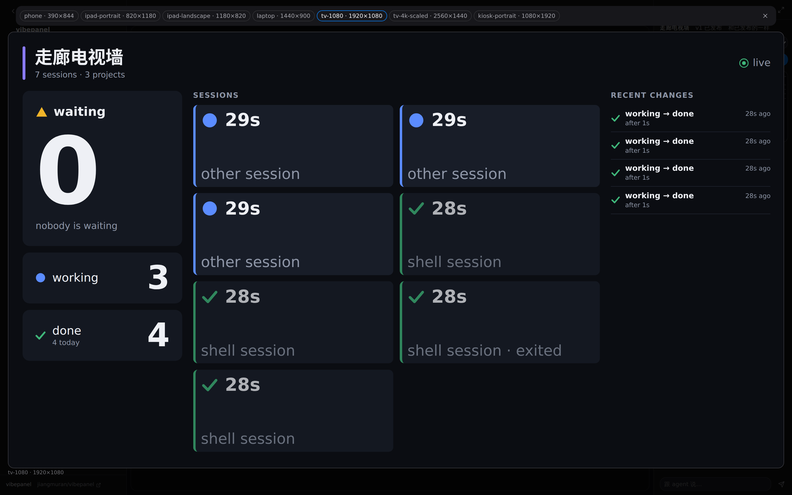
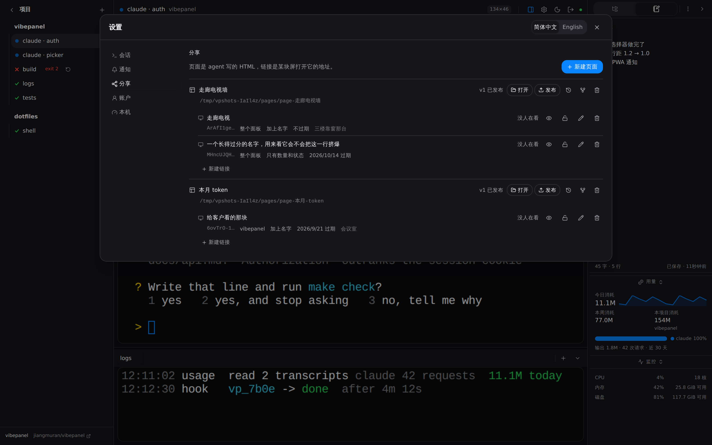
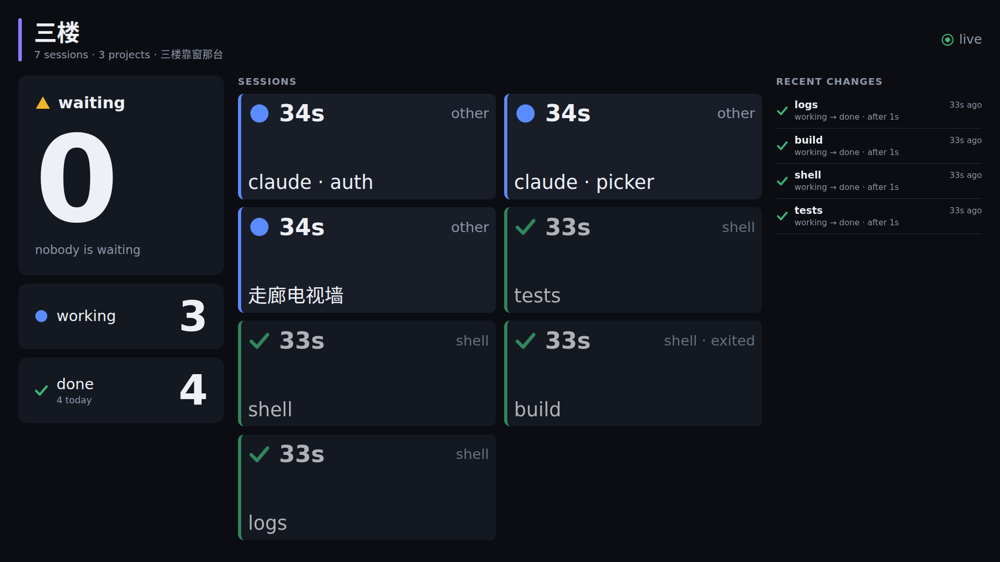
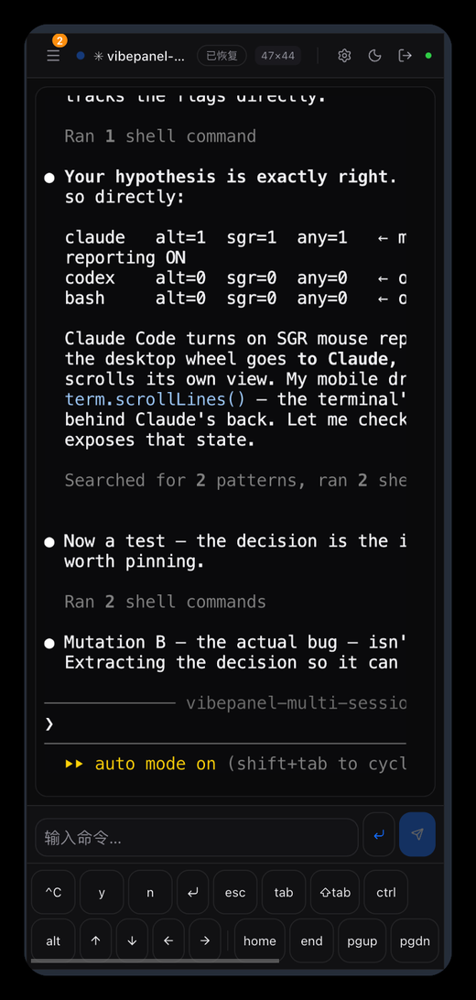
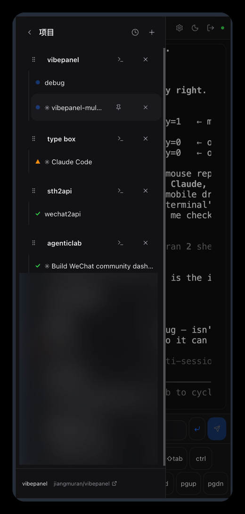
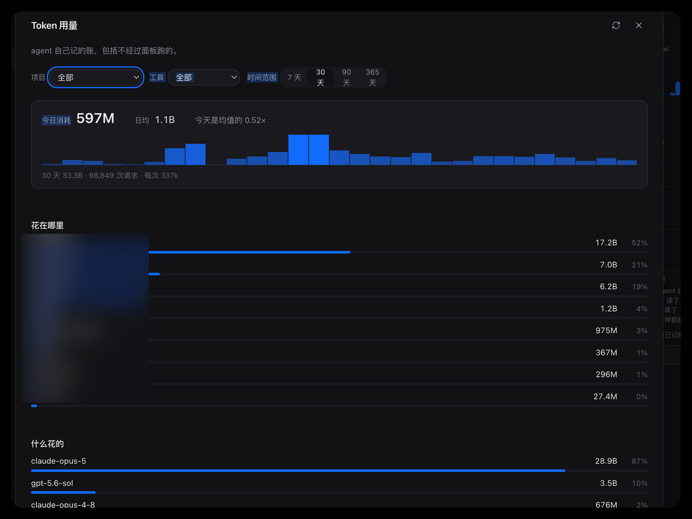
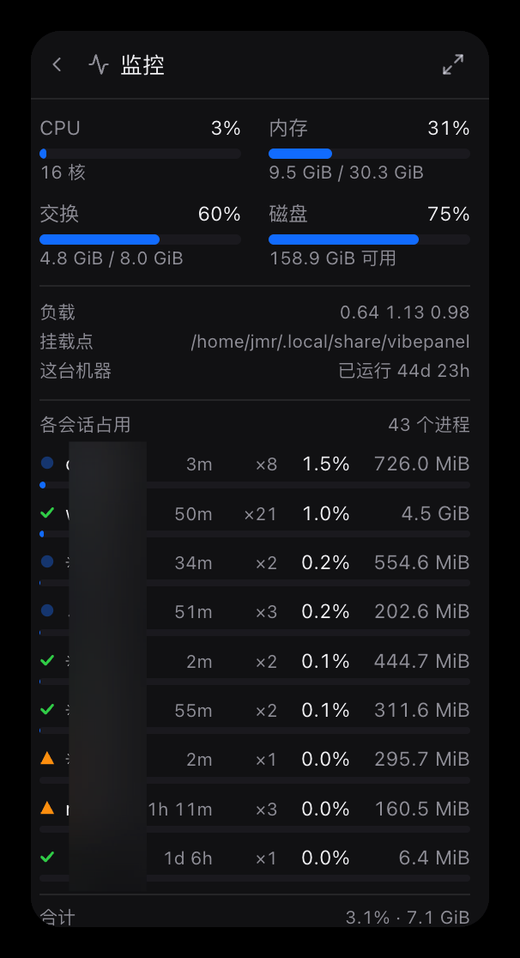

<div align="center">


# vibepanel

**A console for developers running several agents across several projects at
once. Stable, private, quick, and good to look at.**

[](https://github.com/jiangmuran/vibepanel/actions/workflows/check.yml)
[](go.mod)
[](LICENSE)

**English** · [简体中文](README.zh-CN.md)

</div>

<p align="center">
  <picture>
    <source media="(prefers-color-scheme: dark)" srcset="docs/images/hero-dark.png">
    
  </picture>
</p>

## What it is

vibepanel is a working terminal for people who lean on agents hard. The front
end and the back end are separate: your terminals live in a dedicated system
service with a memory floor and a high priority, so an OOM or a crash somewhere
in the application layer does not cost you a session. The interface is a web
page, which means you can point it at a development box and reach it from
whatever device is in your hand.

On the security side, every line of the source is public and every release is
packaged by a public GitHub Action. What comes out is one Go binary with no dependencies
that never phones home, which is about as much as I can do for safety,
portability and speed at the same time. Upgrading or restarting the panel does
not touch a single session or a single running agent. It terminates its own
TLS, so you can put it on https and require a password or a passkey to get in.

On the UI side there are a lot of small deliberate things. The whole model is
projects and sessions, so you can see at a glance what every session in every
project is doing: finished, working, or waiting on you. Down the right there is
a file manager and a notebook, and you can move files and images in and out by
copy and paste, the way you would on your own machine.

Along the bottom I added a scratch terminal, because that is how I work: it is
there to look at a file or run something while the agent is still going, and it
saves you from interrupting the agent to ask. There is a separate interface
built for phones, and you can turn on system notifications or point them at a
channel of your own. Leaving the house stops being a reason to stop shipping.

And you do not even need the page open. Pair the panel with a Telegram bot, a
飞书 app or 微信 and a session that wants you sends a card there: which session,
what it is waiting for, and on Telegram and 飞书 an *Allow* and a *Deny* button
right under it. Reply `3: run the tests again` and the words go into session 3;
`shot 3` sends back a picture of the pane. Turn on the advanced mode and you can
just say "tell the docs one to add a changelog entry", and a headless Claude
Code or Codex works out which session you mean, then waits for your `ok` before
it types anything.

The panel knows when an agent is actually done, not only when it has gone
quiet: one click installs a hook into Claude Code, Codex, Kimi Code, zcode or
opencode, showing you what it will write and backing the file up first. And
upgrading is a button too: Settings → Updates downloads the release, checks it
against `SHA256SUMS`, runs the new binary once before trusting it, swaps it in
and restarts, with every session still running afterwards.

The other thing I am fond of is share links. Put the whole system's status on a
monitor, or put tokens spent against code produced on a big screen so whoever
needs convincing can see it. What the screen shows is a page you have an agent
write, in its own project, with a live preview beside the terminal: start from a
template, publish, make a link, open it on the screen. Click the preview and it
opens large over the whole window, on a phone, a laptop or a television, so you
see what the wall will see before you hang it. Pages live beside the panel's own
data unless you say otherwise, and travel between panels as a zip. ~~Fine, I
know this is a niche feature. I still think it matters.~~

I will say this plainly: this is **not AI slop**. It is a terminal I use hard
every day and it is genuinely nice to use. I hope it saves you some time and
that you enjoy it. It is early, so come and join in if you have ideas or
complaints.

<p align="center">
  
</p>
<p align="center">
  
  
</p>
<p align="center"><sub>Share pages: an agent writes it beside a live preview you can open large, you publish it, and a link puts it on a screen. <a href="docs/features.md#screens-for-other-people">How</a>.</sub></p>

<p align="center">
  
  
</p>
<p align="center"><sub>A separate interface built for phones.</sub></p>

<p align="center">
  
  
</p>
<p align="center"><sub>What every project and model has spent, and what every session is costing the machine.</sub></p>

## Who it is for

Anyone who has several terminal agents open at once and needs to keep track of
them, or who has a development machine they want working around the clock and
reachable from any device.

## The interactive installer (Linux/macOS)

It speaks 简体中文 and English and supports several ways of installing. The
comparison between them, and unattended installs, are further down.

### Standard

```sh
curl -fsSL https://raw.githubusercontent.com/jiangmuran/vibepanel/main/install.sh | sh
```

### Where the network is restricted

This is a public GitHub mirror run by jiangmuran. To keep it from being abused,
the first run prints a prompt in your terminal asking you to pass a check in a
browser.

```sh
curl -fsSL https://github.muran.tech/https://raw.githubusercontent.com/jiangmuran/vibepanel/main/install.sh -o vibepanel-install.sh \
  || curl -sSL https://github.muran.tech/https://raw.githubusercontent.com/jiangmuran/vibepanel/main/install.sh
sh vibepanel-install.sh --mirror
```

### Managing it afterwards

```sh
vibepanel service status | start | stop | restart | logs | token | upgrade | uninstall
```

The rest is in [docs/install.md](docs/install.md): user unit against system
unit, every flag, unattended installs, creating the first account from the
command line, Docker, and building from source.

## Features

[docs/features.md](docs/features.md) — including sessions on a phone through
Telegram, 飞书 or 微信, with replies going back into the session.
⚠️ Written by AI ⚠️

## Flags and troubleshooting

Every flag has a `VIBEPANEL_<UPPER_SNAKE>` environment equivalent, and the flag
wins. A `VIBEPANEL_*` variable nothing reads is reported at startup and by
`doctor` rather than ignored, so a renamed setting is loud instead of quietly
doing nothing. The full table is in [docs/install.md](docs/install.md).

The same binary is also the admin CLI: `serve`, `project`, `session`, `hook`,
`service`, `account`, `doctor` and `version`.

## Driving it from a program

```sh
TOKEN=…   # Settings → API tokens

curl -sX POST https://panel.example.com:18443/api/sessions \
  -H "Authorization: Bearer $TOKEN" -H 'Content-Type: application/json' \
  -d '{"projectId":"…","title":"billing","command":["claude"]}'
```

`command` is an argv; leave it out and you get a shell, which is what the
panel's own interface sends. Everything the front end can do is available over
the same API. [docs/api.md](docs/api.md) is the whole surface, and it is checked
against the router in both directions: an endpoint missing from the page and a
paragraph describing one that no longer exists both fail the build.

## Design notes

The principles the rest follows from:

- **The page is a view, not the state.** Close it, open it in three places,
  reload it mid-command; the sessions never notice.
- ***Done* means the process exited**, not that a session went quiet.
- **Colour is never the only carrier of meaning.**

## Development

```sh
make check         # vet, gofmt, eslint, Go tests, frontend units — the fast gate
make verify        # everything, including the browser checks (~20 min)
make head-check    # build and test a clean worktree at HEAD, not the working tree
```

`make check` never starts a browser. Most of this project's bugs were found by
the ones that do:

| | |
|---|---|
| `make panes-check` | the side panel's pane layout: drag, drop, merge, restore |
| `make first-run-check` | the setup wizard and the first project |
| `make render-check` | layout, states, arbitration, panels, mobile, clipboard, passkeys |
| `make stress-check` | wide characters, full-screen programs, scrollback, floods, dropped sockets |
| `make restart-check` | kill the backend; the sessions and the login must outlive it |
| `make scale-check` | two dozen sessions: snapshot size, sidebar reachability, poller |
| `make pages-check` | share pages: the sandbox from inside a page, the editing loop, every template |
| `make tls-check` | its own TLS: wss, the Secure cookie, swapping a certificate |
| `make install-check` | both installers down every branch, in both languages |
| `make release-check` | build the archives and run one from a throwaway HOME |

The tmux wrapper is tested against a real tmux on a throwaway socket rather than
a mock; `TEST_TMUX_BIN=/path/to/tmux go test ./...` points it at another build.
`web/scripts/shots.mjs` takes screenshots by booting the real binary and
photographing it.

`AGENTS.md` has the conventions and the red lines.

## License

[PolyForm Noncommercial 1.0.0](LICENSE), with attribution terms. Personal use,
study, research and other noncommercial use are free, including changing it and
sharing what you changed, as long as the author credit and license notices stay
exactly as they are and your version says it is based on vibepanel. Commercial
use, whether inside a company, as a hosted service or bundled into a product,
needs a separate license: write to
[jmr@jiangmuran.com](mailto:jmr@jiangmuran.com).

Releases up to and including v1.20.1 were published under the MIT License, and
copies obtained under it keep it.
