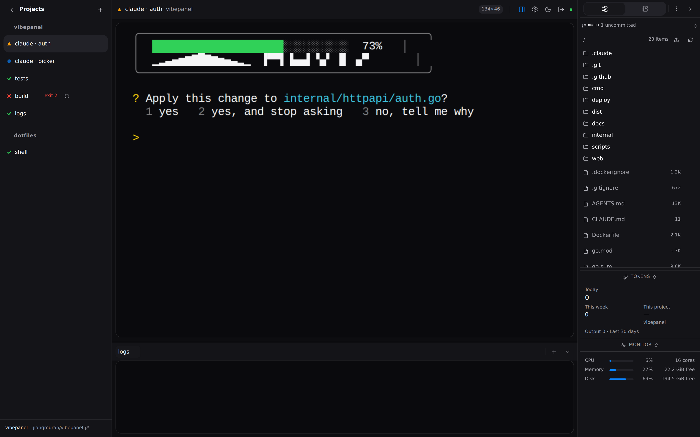

<div align="center">


# vibepanel

**Run a dozen coding agents at once and see which one is waiting for you.**

[](https://github.com/jiangmuran/vibepanel/actions/workflows/check.yml)
[](go.mod)
[](#requirements)
[](LICENSE)

**English** · [简体中文](README.zh-CN.md)

</div>



<sup>The sidebar is every session, grouped by project, with whatever is blocked
on you at the top. Triangle: stopped to ask a question. Circle: still working.
Check: finished. Cross: exited non-zero. The strip along the bottom is a scratch
terminal attached to the selected session. On the right, the project's files,
and under them the machine's CPU, memory and disk.</sup>

## What it is

A single Go binary that serves one web page. Every session it creates is a real
tmux session holding a shell in a project's directory. You type the command:
`claude`, `codex`, a test loop, a `tail -f`.

The panel takes care of what tmux has no opinion about. Sessions belong to
projects. Names stick. Status is readable at a glance and the ones that need you
sort to the top. Each project carries notes, todos and a file tree. The whole
thing works on a phone.

Nothing you run belongs to the panel. Restart it, upgrade it or kill it, and
the agents carry on under tmux.

## Who it's for

You keep several agents going at once, across more than one repository, on a
machine that stays up: a workstation you also reach from a laptop, or a VPS you
check from your phone.

If you run one agent at a time in a terminal that is already in front of you,
you do not need this.

Three things to know before you install:

- **Linux, amd64 or arm64.** The machine monitor reads `/proc` and the installer
  writes systemd units. A `darwin/arm64` binary is built and the panel runs, but
  the monitor is blank and you supervise it yourself.
- **One account.** No sharing, no roles. For a second screen there is a
  [read-only share link](#share-links).
- **Agents run as you**, with your keys, your dotfiles and your repositories.
  Anyone who gets into the panel has a shell as you.

## Requirements

tmux 3.3 or newer — `apt install tmux`, or let the installer do it. Nothing
else: the release binary is static, with the frontend, the database driver and
the TLS client inside it.

The 3.3 floor is `allow-passthrough`. An older tmux still starts the panel, and
agent TUIs lose the escape sequences they use for progress bars and
notifications. `vibepanel doctor` reports it.

CI runs the suite on tmux 3.4; development is on 3.6. Point it at another build
with `TEST_TMUX_BIN=/path/to/tmux go test ./...`.

## Install

| | Use it when | Sessions survive | Needs root | Starts at boot |
|---|---|---|---|---|
| **System service** (default where root is available) | Root is there. Also if the box runs close to its memory, or the panel must be up before anyone logs in | a panel restart, a crash, a logout — and the kernel reaches for it last under memory pressure | once, to install | yes |
| **User service** | No root here, or it is your account on a shared box | a panel restart, a crash, a logout | no | yes, via lingering |
| **Just run it** | Trying it out, or you have a supervisor you like | a panel restart | no | no |
| **Docker** | You want it contained and can afford to lose sessions | **nothing** — in a container tmux is a child of the entrypoint, and `docker restart` takes every agent with it | no | container policy |

Install one, never both: two units are two panels on one tmux socket, and the
installer refuses rather than quietly making the second. On macOS there is one
kind, a LaunchAgent.

One line, on Linux or macOS, on a machine with nothing on it:

```sh
curl -fsSL https://raw.githubusercontent.com/jiangmuran/vibepanel/main/install.sh | sh
```

It works out the platform, fetches the matching release, checks it against the
published `SHA256SUMS`, offers to install tmux if it is missing or too old, and
installs the service — a systemd unit on Linux, a launchd LaunchAgent on macOS.
From an unpacked archive, `./deploy/install.sh` is the same installer without
the download.

It asks which service, prints the plan, and waits for you to agree. It prompts
only when stdin and stdout are both terminals, so a pipeline gets the unattended
path. `... | sh -s -- --help` lists everything it can do.

Then open `http://<host>:8443`, paste the setup token it printed, and choose a
password — or create the account from the installer with `--username you
--password-file /path/to/pw`. There is deliberately no `--password <value>`:
that is a password in your shell history and in `ps`.

Afterwards, one command whichever way it runs:

```sh
vibepanel service status | start | stop | restart | logs | token | upgrade | uninstall
```

<details>
<summary><b>The system service</b></summary>

```sh
./deploy/install.sh --system          # add --migrate to replace a user unit
```

Same panel, same data, same account: the unit drops to `User=<you>`. What it
buys is `OOMScoreAdjust=-500`, which a user unit cannot have, so the panel and
the tmux server holding your sessions are the last things the kernel kills.
Choose it if the machine runs close to its memory, or if the panel has to be up
before anyone logs in.

Both units carry `MemoryHigh=20G` and `MemoryMax=26G`, sized for a 32 GB machine
running a dozen agents. Lower them on a small VPS.

Install one or the other, never both: two units are two panels on one tmux
socket and one database, and the symptom is a panel that forgets things. The
installer refuses unless you pass `--migrate`, which removes the old unit first.

</details>

<details>
<summary><b>Unattended, for CI and <code>curl | bash</code></b></summary>

```sh
./deploy/install.sh --yes --enable    # no questions, user service, start it
./deploy/install.sh --yes --system    # no questions, system service (needs root)
./deploy/install.sh --help
```

`--yes` takes every default, `--enable` starts the service, `--user` and
`--system` pick the unit, `--migrate` allows replacing one kind with the other.
Without root it says so and installs the user service.

For a user service the installer also enables lingering. Without it the unit
stops when your last login session ends.

</details>

<details>
<summary><b>From source</b></summary>

```sh
cd web && npm ci && npm run build && cd ..
make build            # CGO_ENABLED=0 go build -o vibepanel ./cmd/vibepanel
./vibepanel doctor
./vibepanel serve
```

</details>

<details>
<summary><b>Docker</b></summary>

```sh
docker compose -f deploy/docker-compose.yml up -d
```

Restarting the panel in a container kills every session, and nothing in the image
can change that: tmux is a child of the entrypoint and the container is the
boundary, so `docker restart` and any rebuild take the agents with them. Agents
also see only the container's tools, keys and repositories. Run it this way only
if the sessions are cheap to lose.

</details>

## Using it

1. **Add a project** — a name and a directory. The picker filters as you type,
   or jumps to a path you paste.
2. **Open a session** — you get a shell in that directory. Type `claude`, or
   `codex`, or `npm run dev`. The panel does not launch agents for you.
3. **Rename it** if you like. The automatic title from the pane stops
   overwriting a name you chose.
4. **Close the tab.** The session is a tmux session and does not notice.

Sessions sort by urgency inside their project, so the one that stopped to ask you
something sits at the top. Pin anything you want held in place. Each session can
carry scratch terminals, the strip along the bottom of the screenshot. They open
in the same directory, for a `git status` that does not interrupt the agent
above.

<div align="center">


</div>

### States

Shape carries the meaning as much as colour does.

| | | |
|---|---|---|
| ▲ | **waiting** | the agent stopped and wants a human; sorts first |
| ● | **working** | producing output, or thinking |
| ✓ | **done** | finished, or a shell at its prompt |

A process that is gone gets its own shape: a cross for a non-zero exit with the
status in the label, a hollow square for a clean one, a dashed square when the
tmux session itself has vanished. You can mark a live session *waiting* or *done*
by hand, and it stays that way until the session does something new.

### On a phone

A layout of its own: a command composer that gets along with an IME, a soft key
row with `esc` `tab` `ctrl` and the `y`/`n`/`1`/`2` answers agents ask for, and
touch selection with drag handles.

Add it to the home screen and it is a PWA with notifications, fired when a
session becomes *waiting*, and never while you are looking at the page. These are
browser notifications, not Web Push. They arrive while the page is alive, in a
background tab or in the installed app. A closed browser gets nothing.

### The side panel

Six tabs per project, over a strip of machine CPU, memory and disk that stays
visible on all of them.

- **Files** — browse and download. Drag onto the tree or onto the terminal to
  upload; the file lands next to the session and its absolute path is typed at
  the prompt, ready to press enter on. Pasting a screenshot into the terminal
  does the same. Preview reads the file's magic bytes rather than its name and
  handles text, PNG, JPEG, GIF, WebP, AVIF and PDF, up to 8 MiB. Long text is
  truncated at 256 KiB or 4,000 lines.

  An `.html` or `.svg` file is *drawn*, in a frame with an opaque origin, no
  scripts and a policy that permits it no network at all — so a page in a
  project cannot reach the panel's cookie and cannot fetch anything while you
  look at it. **Source** is beside it in the header at all times, and scripts
  are a per-file switch that starts off every time.
- **Repo** — what the working tree is doing: the branch, how far it is from its
  upstream, what is uncommitted and the last fifteen commits, all read off the
  disk with no credential. Sessions sitting in a different worktree get a row of
  their own with their branch on it. One button asks GitHub about open pull
  requests and joins them to those branches by name; it needs `GITHUB_TOKEN` or
  `GH_TOKEN` in the panel's environment, it runs only when pressed, and without
  a token the rest of the tab is unchanged.
- **Monitor** — the machine, plus CPU and memory per session, summed over each
  session's whole process tree. The percentage is a share of the machine, not of
  one core.
- **Notes** and **Todos** — markdown and a list per project, saved as you stop
  typing.
- **Tokens** — what the agents recorded spending, today and over thirty days.
  The numbers come from the transcripts Claude Code and Codex write for
  themselves. Nothing is estimated and nothing is priced; where there is no
  transcript to read the panel shows a dash rather than a zero.

### Share links

**Settings → Read-only share links** makes a URL for the monitor beside you:
`https://<panel>/share/<token>`. It opens a dashboard and nothing else — no
terminal, no write path, no file browser, no way to make a second link from the
first.

What the dashboard shows is a **board** you pick when you make the link.
Nineteen starting points, grouped by who is looking at the screen:

| | |
|---|---|
| while you work | overview · does anything need me · the waiting queue · every session as a tile · everything at once |
| a screen on a wall | four numbers and a clock · one number filling the screen · how busy it is · three pages that cycle |
| whoever runs the machine | only the machine · what has gone wrong |
| a manager | cost against output · where it went · the calm one · the year as a grid of days |
| one thing, closely | per project · which model is working · what today cost |

A preset is a starting point, not a mode. Every widget moves, resizes, points at
a different number or splits by a different dimension — agent, project, model,
day, month — and there are twenty-one kinds to add. The board is stored with the
link and collapses with the viewport, so one stored board is a summary on a
phone and forty tiles on a television.

The numbers are what the panel already knows: states and how long each has held,
CPU and memory per session, the machine, checklist progress, and what the agents
recorded spending. Tokens, never money — prices differ by model and tier and
change, and a figure from a stale table is a confident wrong number on a wall.

Scope it to the whole panel, one project or one session. The project-scoped link
is the one you send to somebody working on that project. Scope is enforced by
the server from the link's own row; delete the project and the link shows
nothing rather than falling back to everything.

Pick the detail level when you make it. **Counts** shows shapes and numbers and
no text at all. **Names** adds session titles and project names. Neither ever
sends a path, a working directory, a command line, a hostname or the panel's own
ids. The board can be changed later; the detail level and the scope cannot — by
then the URL is in somebody's email, and widening what it discloses is a change
they would never see.

Treat the link as a credential: anyone holding it can watch. The panel stores
only a hash, so the moment you create it is the only time it can be read. Links
are revoked individually, can be given an expiry, and their creation and
revocation are in the audit log.

The dashboard says *live*, *reconnecting* or *disconnected* in words and shapes,
and always shows the time of the last reading and how long ago it was.

## Restarts, reboots and upgrades

A restart of the panel costs nothing:

```sh
systemctl --user restart vibepanel   # the panel goes away and comes back
tmux -L vibepanel ls                 # every session still there, still running
```

The panel attaches to tmux as a client and never owns a session's terminal, and
it runs on its own socket (`-L vibepanel`) with its own config, so it sits
happily beside an existing tmux or zellij setup. Browsers with the panel open
notice the new build on reconnect and offer to reload.

**A reboot is different.** The tmux server is an ordinary process and its
scrollback is in that process's memory, so the machine going down takes both.

The panel keeps what it needs to rebuild each session: the command it was created
with, its directory, its name and place, and the last 2,000 lines or 256 KiB of
its scrollback, captured every thirty seconds and again at shutdown. An orderly
reboot loses no output; a power cut loses up to half a minute.

When it comes back it offers to restore them, one or all, showing the command
each will run and where. There is a per-session switch for the ones you want back
without being asked; it is off by default.

The **processes** do not come back. An agent's context lived in its process and
in a conversation with a provider, and re-running the command starts a new agent
that remembers none of it. The restored pane says so in a banner above the new
process, and the session keeps a `restored` mark afterwards.

**Upgrading.** Settings → Update fetches the newest release from GitHub, checks
it against the published `SHA256SUMS`, swaps the binary and restarts the service,
keeping the old binary as `.old`. It runs only when you press the button: no
scheduled check, no heartbeat, no telemetry. Or unpack the new archive and run
`./deploy/install.sh` again, which keeps the unit you already have and restarts
it. Either way your sessions keep running.

Two things behave in ways worth knowing:

- **A changed tmux config takes effect at the next `start-server`.** tmux reads
  its config once and the panel never kills its server, so an upgrade leaves the
  new file on disk and the old settings in memory. The settings page and
  `vibepanel doctor` both say when that has happened. Applying it means
  `tmux -L vibepanel kill-server`, which ends every session.
- **An older binary refuses a database a newer one has migrated**, and names both
  versions rather than opening it and dropping columns.

[docs/runbook.md](docs/runbook.md) is organised by symptom for everything else.

## State reporting

Left alone, the panel reads the output stream: recent bytes mean *working*, a
terminal bell means *waiting*, a pane back at a shell prompt means *done*. A
silent session is never called finished.

**Settings → state reporting** has a button for Claude Code and one for Codex. It
merges a hook into the agent's own config, showing you what it will write and
backing up the file first. The hook reads two environment variables the panel
injects into each session and posts the state:

```json
{"sessionId": "…", "state": "waiting"}
```

Sessions started outside the panel do not have those variables, so the same
global config does nothing for them. Uninstalling removes only the entries
vibepanel added. The hook is a `/bin/sh` script that calls `curl`; without curl
the panel falls back to guessing and says nothing about it.

Claude Code exposes four events and reports *working*, *waiting* and *done*.
Codex has a single `notify` command, so a Codex session reports *waiting* and
guesses the rest.

Other agents have no button. Anything can report by posting to
`/api/hook/state` itself; the shape is in [docs/api.md](docs/api.md).

## Reaching it over a network

The panel listens on `:8443`, every interface, and is built to face the public
internet.

Everything needs a credential, including the WebSocket, which is the terminal.
The exceptions are the health probe, the hook endpoint (which takes a token
injected into every session) and the share dashboard (which takes a share token,
on one `GET`, and is rejected everywhere else).

First run prints a one-time setup token to the console: whoever can read the
server's output claims the panel. The endpoint closes once an account exists.
Failed logins back off exponentially per source address, and `--allow-from`
limits who can reach the panel at all. Both judge the address that
`--trusted-proxies` says to trust; with none configured that is the peer on the
socket and `X-Forwarded-For` is ignored.

**Passkeys** sit on top of the password and never replace it. WebAuthn needs a
registrable domain name, so an IP address can never register one however the TLS
is arranged. Use a hostname. `vibepanel doctor` and the sign-in screen both say
whether the current configuration supports them.

**API tokens** are independent of the password: changing the password signs out
browsers and leaves tokens alone, and the reverse. A token is readable once, when
you create it.

**TLS** is the panel's own, either supplied or issued:

```sh
# your own certificate, reloaded when the files change
vibepanel --domain panel.example.com --tls files \
          --tls-cert /etc/ssl/panel.pem --tls-key /etc/ssl/panel.key

# or issued and renewed automatically
CLOUDFLARE_API_TOKEN=… vibepanel --domain panel.example.com \
          --tls acme --acme-dns cloudflare --acme-email you@example.com
```

Automatic certificates use DNS-01, since HTTP-01 needs port 80. Cloudflare is
the provider that is wired up. Leaving TLS off anywhere but loopback is warned
about at startup.

## Configuration

Every flag has a `VIBEPANEL_<UPPER_SNAKE>` environment equivalent, and flags win.
A `VIBEPANEL_*` variable nothing reads is reported at startup and by `doctor`
instead of being ignored.

| Flag | Default | Notes |
|---|---|---|
| `--data-dir` | `~/.local/share/vibepanel` | database, tmux config, ACME state |
| `--addr` | `:8443` | listen address |
| `--domain` | — | public hostname; also the WebAuthn Relying Party ID |
| `--tls` | `off` | `off`, `files` or `acme` |
| `--tls-cert` / `--tls-key` | — | for `--tls files`; reloaded when the files change |
| `--acme-dns` | — | DNS-01 provider for `--tls acme` (`cloudflare`) |
| `--acme-email` | — | contact address for the CA |
| `--acme-directory` | Let's Encrypt | point at a staging endpoint while testing |
| `--allow-from` | — | CIDRs allowed to reach the panel; empty means all |
| `--trusted-proxies` | — | CIDRs whose `X-Forwarded-For` may be believed |
| `--tmux-socket` | `vibepanel` | keep it dedicated to stay isolated |
| `--static-dir` | — | serve the frontend from disk instead of the embedded build |

The binary is also the admin CLI: `serve`, `project`, `session`, `hook`,
`doctor`, `version`. `doctor` prints fifteen lines and never stops at the first
failure: tmux and its version, the data directory, the database and a real write
to it, disk, socket isolation, a stale tmux config, hook URLs and tokens that
live sessions still hold, passkeys, and unread `VIBEPANEL_*` variables.

## Driving it from a program

```sh
TOKEN=…   # Settings → API tokens

curl -sX POST https://panel.example.com:8443/api/sessions \
  -H "Authorization: Bearer $TOKEN" -H 'Content-Type: application/json' \
  -d '{"projectId":"…","title":"billing","command":["claude"]}'
```

`command` is an argv; omit it for a shell, which is what the panel's own UI
sends. Everything the frontend does is available over the same API.
[docs/api.md](docs/api.md) is the whole surface, and it is checked against the
router in both directions.

## Design notes

Three that change what you do:

- **The page is a view, not the state.** Close it, open it in three places,
  reload it mid-command; the sessions never notice.
- ***Done* means the process exited**, not that a session went quiet.
- **Colour is never the only carrier of meaning.**

[docs/design.md](docs/design.md) has the reasoning behind the decisions that
would otherwise look arbitrary. [docs/build-log.md](docs/build-log.md) is the
chronological record of what was built and what fought back.

## Development

```sh
make check         # vet, gofmt, eslint, Go tests, frontend units — the fast gate
make verify        # everything, including the browser checks (~20 min)
make head-check    # build and test a clean worktree at HEAD, not your tree
```

`make check` never starts a browser. Most of this project's bugs were found by
the ones that do:

| | |
|---|---|
| `make first-run-check` | the setup wizard and the first project |
| `make render-check` | layout, states, arbitration, panels, mobile, clipboard, passkeys |
| `make stress-check` | wide characters, full-screen programs, scrollback, floods, dropped sockets |
| `make restart-check` | kill the backend; the sessions and the login must outlive it |
| `make scale-check` | two dozen sessions: snapshot size, sidebar reachability, poller |
| `make tls-check` | its own TLS: wss, the Secure cookie, swapping a certificate |
| `make install-check` | `deploy/install.sh` down every branch, without sudo |
| `make release-check` | build the archives and run one from a throwaway HOME |

The tmux wrapper is tested against a real tmux on a throwaway socket rather than
a mock. `web/scripts/shots.mjs` takes the screenshots in this file by booting the
real binary and photographing it.

`AGENTS.md` has the conventions and the red lines.

## License

[MIT](LICENSE)
