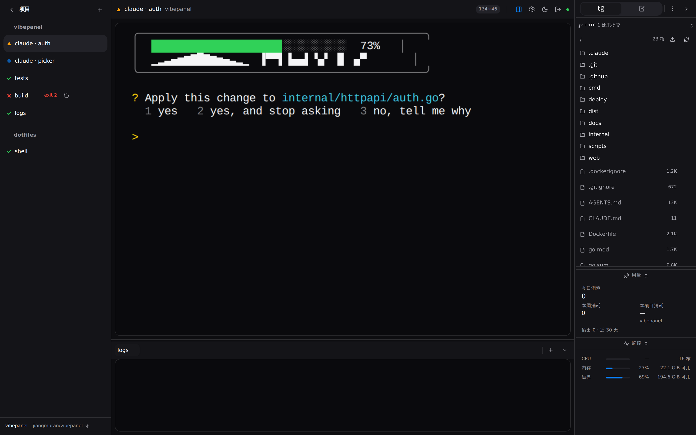
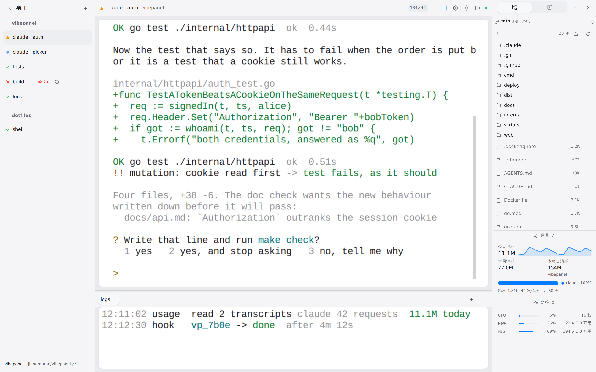
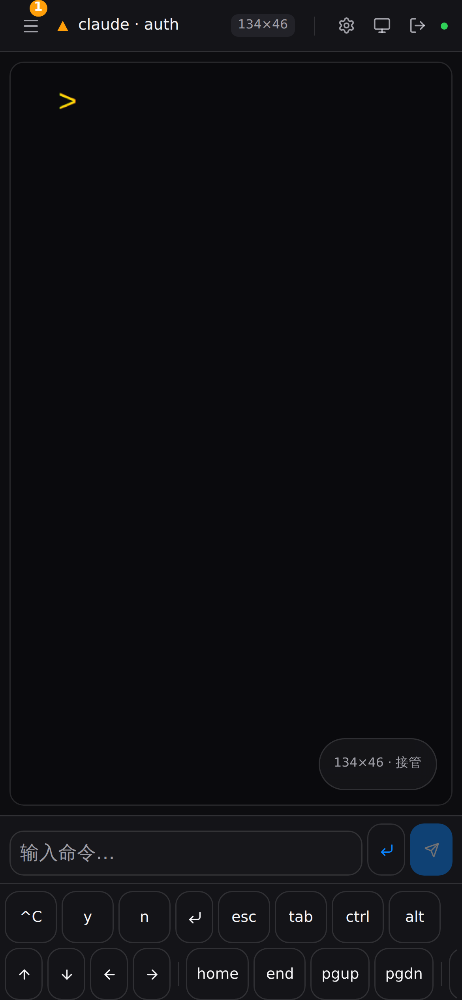

<div align="center">


# vibepanel

**一个把几十个 coding agent 会话管起来的网页控制台。**

进程活着这件事交给 tmux；剩下的全部交给浏览器 —— 会话怎么归到项目下、叫什么名字、
现在哪一个在等你、按什么顺序排。

[](https://github.com/jiangmuran/vibepanel/actions/workflows/check.yml)
[](go.mod)
[](#环境要求)
[](LICENSE)

[English](README.md) · **简体中文**

</div>



## 它解决什么问题

同时开十几个 coding agent，终端复用器给你的是一排都叫 `bash` 的 tab。哪个 agent 在等你
确认、哪个还在干活，不一个个点进去看不出来；同一个项目的 tab 和另外五个项目的混在一起；
手机上基本没法用。

这本质上是个**任务管理**问题，只是穿了一身终端的外衣。vibepanel 把这两件事拆开：
**tmux 负责让进程活着，网页负责组织。**

## 你会得到什么

- **会话比面板活得久。** 每个会话都是独立 socket 上的一个 tmux 会话。面板重启、升级、
  崩溃，会话全都不受影响 —— 进程是 tmux server 的子进程，不是这个程序的。
- **隔着房间也看得懂的状态。** *在动*、*等你处理*、*已完成*。「等你处理」排在最前面，
  也是屏幕上最显眼的东西。装了 hook 就是 agent 自己上报，没装就从输出流里读。
- **项目分组、改了名就不会被改回去。** 你手动改过的名字，pane 的自动标题不会再覆盖它。
- **同一个会话可以在好几个地方同时看。** 每个会话只有一个权威网格，归属于最后打字的那
  一端；其他端是缩放显示而不是重排 —— agent 的 TUI 在手机上不该变成一堆碎纸。
- **手机端不是把桌面端缩小。** 单独的命令输入框（对中文输入法友好）、一排软键
  （`esc` `tab` `ctrl`，以及 agent 真正会问你的 `y`/`n`/`1`/`2`）、双手柄拖选复制。
- **传文件不用终端内协议。** 点一下就下载；把文件拖到终端上就上传 —— 文件落在会话旁边，
  绝对路径直接替你敲进命令行，回车就能用。截图直接粘贴进终端也是一样。
- **每个项目自带笔记、待办、文件树和系统负载**，都在右栏。
- **English 和简体中文**，按浏览器语言自动选，也可以在设置里切。
- **可以装成 App。** PWA + 通知权限：会话变成「等你处理」时，即使面板在后台也能推到手机上。
- **旁边那块屏幕上的只读看板。** 在设置里生成一个分享链接，在另一台显示器上打开：机器负载、
  每个会话在花多少 CPU 和内存、谁在等你，字大到隔着房间也读得清 —— 而且断没断线一眼就能
  分辨，不会把「卡住了」看成「很安静」。这个链接只能打开那一个页面，默认连名字都不显示。
- **给 agent 用的 HTTP API**，令牌和密码互相独立 —— 见 [docs/api.md](docs/api.md)。
- **Passkey、密码、自带 TLS**，包括 DNS-01 自动签发续期。它是照着「直接挂在公网上」设计的。

<div align="center">


</div>

## 环境要求

- **tmux 3.3 或更新**（`apt install tmux`）。

  要 3.3 而不是 3.2，是因为内置配置里用了 `allow-passthrough`，这个选项 3.3 才有。旧版
  tmux 不会拒绝启动：它报一句「未知选项」，然后带着默认值继续跑，从此 agent TUI 用来做
  进度条和通知的那些转义序列被静悄悄吞掉。

  测试套件除了 3.6 之外也跑 **3.4**（Ubuntu 24.04 LTS 自带的版本），因为这两个版本有两处
  差异会一路影响到产品：tmux 如何转义自己 `-F` 输出里的控制字符，以及它重绘已连接客户端
  的积极程度。用 `TEST_TMUX_BIN=/path/to/tmux go test ./...` 可以指向任意一个 tmux。
- **其他什么都不需要。** 发布版是静态单二进制，前端、数据库驱动、TLS 客户端全在里面。

## 安装

在任何一台装了 tmux 的机器上，解开发布包：

```sh
tar -xzf vibepanel_<version>_linux_amd64.tar.gz
cd vibepanel_<version>_linux_amd64
./deploy/install.sh
```

它会问你。装哪一种服务、要不要现在就起来，然后把接下来要做的事整个列出来，等你点头才
动手。跑完会告诉你：装的是哪个 unit、是「启动」还是「重启」、一次性的 setup token 在哪
里看、以及该打开哪个地址。

默认是 systemd **user** service，因为面板是以你的身份、用你的密钥和你的 dotfiles 跑
agent 的，整件事不需要 root。安装脚本还会顺手替你开 lingering —— 这不是可选项：user
service 会在你最后一个登录会话结束时停掉，而一个「你一登出就死」的面板只是看起来能用。

如果这台机器上拿得到 root（你就是 root，或者 `sudo` 能用），它会把系统级服务也作为一个
选项摆出来，并且就在问你的地方把区别讲清楚。如果拿不到 root，它会直说，然后改装 user
service —— 它不会因为一件你当下无法解决的事情而失败。

打开 `http://<主机>:8443`，粘贴 setup token，设一个密码。首次配置到此结束。

<details>
<summary><b>无人值守：CI 和 <code>curl | bash</code></b></summary>

只有 stdin **和** stdout 都是终端时才会出现提问，所以管道里跑到的就是以前那套行为，不
需要额外交代。要写清楚的话：

```sh
./deploy/install.sh --yes --enable    # 不问，装 user service，并启动
./deploy/install.sh --yes --system    # 不问，装系统级服务（需要 root）
./deploy/install.sh --help
```

`--yes` 全部取默认值；`--enable` 启动服务；`--user` / `--system` 指定 unit 种类；
`--migrate` 允许把已经装着的那一种换成另一种。

</details>

<details>
<summary><b>改成系统级服务</b></summary>

```sh
./deploy/install.sh --system          # 已经装了 user unit 的话再加 --migrate
```

如果机器内存吃得比较紧，或者你希望没人登录时面板也已经起来了，就选它。脚本会把用户名和
home 目录替换进去，写到 `/etc/systemd/system/vibepanel.service`；服务本身依然会切到
`User=<你>` —— 同一个账号、同一套环境、同一批 agent。

区别是实测出来的，不是推测：**user** unit 里写 `OOMScoreAdjust=-500`，进程实际读到的是
`100` —— 调低这个值需要 `CAP_SYS_RESOURCE`，而 user manager 没有。更糟的是
`systemd-analyze verify` 两种写法都放行。系统级 unit 会在切到 `User=` 之前设好，进程才
真的读到 `-500`：这样一来，面板和它手里握着全部会话的 tmux server，会是内核最后才动的
东西。

**两种只能有一种。** user unit 和系统级 unit 同时存在，等于两个面板共用一个 tmux socket
和一个数据库；它们不会吵起来，只会轮流写，症状是「面板会忘事」。安装脚本发现另一种已经
装着时会拒绝，而不是悄悄再装一个 —— `--migrate` 是你明确表示「我就是要换」的方式，它会
先停掉并删掉旧的，再装新的。

</details>

<details>
<summary><b>从源码构建</b></summary>

```sh
cd web && npm ci && npm run build && cd ..
make build            # CGO_ENABLED=0 go build -o vibepanel ./cmd/vibepanel
./vibepanel doctor    # 检查 tmux、数据库、磁盘，以及隔离性
./vibepanel serve
```

</details>

<details>
<summary><b>Docker</b></summary>

```sh
docker compose -f deploy/docker-compose.yml up -d
```

**在容器里，重启面板会杀掉所有会话。** 别处 tmux server 比 Go 进程活得久，这才是
`systemctl restart` 和升级都无害的原因 —— 也是这个项目全部设计的前提。在容器里 tmux 是
entrypoint 的子进程、容器就是边界，所以 `docker restart`、重新构建、任何会重建容器的操作
都会把 agent 一起带走。这一点在镜像内部无解。

而且 agent 只能用到容器里的工具、密钥和仓库，这个世界比大多数人以为的要小。只有在
「会话丢了也无所谓」的前提下才这么跑。

</details>

## 为什么会话不会死

整个系统都是围着这一条性质搭的，所以值得把它怎么保住讲清楚：

- 面板**从不**持有某个会话进程的父 PTY。它跟你一样，只是跑 `tmux attach` 当客户端。
- systemd unit 里写了 `KillMode=process`：停服务时只杀面板，tmux server 和底下所有 agent
  一个都不动。
- tmux socket 固定是 `-L vibepanel` 配自己的配置文件，绝不用默认那个。你可以把它装在一套
  已经跑了好几周的 tmux 或 zellij 旁边，`vibepanel doctor` 还会断言这个 socket 上除了它
  自己的会话什么都没有。

```sh
systemctl --user restart vibepanel   # 面板消失又回来
tmux -L vibepanel ls                 # 会话一个不少，还在跑
```

重连时浏览器会发现后端换了新版本并提示你刷新，所以「跑到一半升级」是一条横幅，而不是
一个谜。

### 升级

```sh
tar -xzf vibepanel_<新版本>_linux_amd64.tar.gz
cd vibepanel_<新版本>_linux_amd64
./deploy/install.sh              # 换掉二进制并重启服务
```

它会沿用你现在装着的那种 unit，不会再问一遍；而且只要服务本来就在跑，不管你有没有加
`--enable` 都会重启它 —— 新二进制躺在磁盘上、旧的还在服务，就是下面那条「看起来什么都
没发生」的故障。

会话不会跟着重启。任何开着面板的浏览器重连后会发现构建变了并提示刷新——网页只是视图，
刷新不花任何代价。

有三件事值得知道，因为它们每一个看起来都像「什么都没发生」：

- **tmux 配置只在下一次 `start-server` 时生效。** tmux 只读一次 `-f` 文件，而面板从不杀
  自己的 server。所以一次改了配置的升级，结果是新文件在磁盘上、旧设置在内存里。设置页和
  `vibepanel doctor` 都会在这种情况下告诉你。要应用它就得 `tmux -L vibepanel kill-server`，
  代价是全部会话——所以面板只是告诉你，而不是替你做。
- **回滚是安全的，但不是静默的。** 旧的二进制会**拒绝**打开被新版本迁移过的数据库，并且
  把两个版本号都说出来。它不会打开它、然后悄悄丢掉自己不认识的列。
- **旧版安装脚本不会重启服务。** 现在的 `install.sh` 会重启，而且会告诉你它做的是哪一种。
  如果你用的是不会重启的旧脚本，那新二进制在磁盘上、旧的还在跑：
  `systemctl --user restart vibepanel` 就是全部修复，怎么认出这个症状见 `docs/runbook.md`。

## 怎么让面板知道 agent 在干什么

不装任何东西时，面板从输出流里猜：刚才有字节出来就是*在动*，收到终端响铃就是*等你处理*，
pane 回到 shell 提示符就是*已完成*。这是诚实的，但是粗糙。

设置页里的**状态上报**会把一小段 hook 合并进 Claude Code 或 Codex 自己的配置文件，各有
一个按钮 —— 先把要写的东西原样给你看，写之前先备份。hook 读两个由面板注入到每个会话里的
环境变量，然后直接把状态 POST 回来：

```json
{"sessionId": "…", "state": "waiting"}
```

面板之外启动的会话没有这两个变量，所以同一份全局 hook 配置对它们完全是空操作。卸载时也
只会删掉 vibepanel 自己打过标记的那几条。

Claude Code 有四个事件，能报 *working*、*waiting* 和 *done*。Codex 只有一个 `notify`，
一条命令对一个事件，所以 Codex 会话只报 *waiting*，其余靠猜 —— 这是设置本来的样子，不是
配错了。那一行会写进 `~/.codex/config.toml` 的**第一个表之前**：TOML 的顶层键属于它上面
那个表，追加到文件末尾就成了最后那个表里的键，Codex 永远读不到。

## 配置

每个 flag 都有对应的 `VIBEPANEL_<大写下划线>` 环境变量，flag 优先。**认不出来的**
`VIBEPANEL_*` 变量会在启动时和 `doctor` 里被报出来，而不是被忽略 —— 曾经一个拼错的
`VIBEPANEL_TLS` 意味着面板在公网端口上明文服务，而运维以为不是。

| Flag | 默认值 | 说明 |
|---|---|---|
| `--data-dir` | `~/.local/share/vibepanel` | 数据库、tmux 配置、ACME 状态 |
| `--addr` | `:8443` | 监听地址；默认是所有网卡 |
| `--domain` | — | 公网主机名；同时也是 WebAuthn 的 Relying Party ID |
| `--tls` | `off` | `off` / `files` / `acme`。非环回地址上用 `off` 会在启动时告警：终端内容、密码和会话 cookie 全都明文过网 |
| `--tls-cert` / `--tls-key` | — | 配合 `--tls files`；文件变了会自动重载 |
| `--acme-dns` | — | `--tls acme` 用的 DNS-01 provider（目前是 `cloudflare`） |
| `--acme-email` | — | 给 CA 的联系邮箱 |
| `--acme-directory` | Let's Encrypt | 测试时指向 staging |
| `--allow-from` | — | 允许访问面板的 CIDR，逗号分隔 |
| `--trusted-proxies` | — | 其 `X-Forwarded-For` 可信的 CIDR |
| `--tmux-socket` | `vibepanel` | 保持专用，才谈得上隔离 |
| `--static-dir` | — | 从磁盘而不是内嵌产物提供前端 |

### 登录

首次启动会把一次性的 setup token 打到控制台。这就是交接动作：**能读到服务端输出的人**才
有资格认领这个面板，仅仅能从网络上够到它不算。一旦建好账号，setup 接口就永久关闭。

除了健康检查和 agent hook 这两个接口，其他全部需要凭据，WebSocket 也一样 —— 它**就是**终端。

登录失败按来源地址做指数退避，`--allow-from` 进一步限制谁能够到面板。这两者判断的都是
`--trusted-proxies` 说可信的那个地址：没有配可信代理时，就是 socket 对端，
`X-Forwarded-For` 被完全忽略。一个能改写调用方身份的 header，等于把这两道控制一起关掉。

### 只读分享链接

**设置 → 只读分享链接** 会生成一个可以挂在另一块屏幕上的地址：
`https://<面板>/share/<token>`。它打开的是一个看板 —— 机器负载、每个会话的 CPU 和内存、
按项目分组的所有会话和它们的状态 —— 除此之外什么都打不开。

这个链接本身就是凭证，请照凭证对待它：谁拿到谁就能看。数据库里只存它的 SHA-256，所以
生成的那一刻是唯一能读到它的时候。每个链接都能单独吊销，可以设过期时间，生成和吊销都
会记进审计日志。

它能到哪里是由路由决定的，不是由某个开关决定的：分享 token 只在一个 `GET` 上被接受，
把它当成会话 cookie 或者 `Bearer` header 递给其他任何接口 —— WebSocket 也算 —— 都会得到
`401`。没有终端、没有写入、没有文件浏览、没有笔记、没有设置，也没法用一个链接再生成一个。

生成时可以选两档：**只有数量**（默认）只显示形状和数字，一个字都不带；**加上名字**会把
会话标题和项目名也发出去。但两档都绝不会发送路径、命令行、主机名和面板自己的 id ——
项目路径会暴露客户名和 home 目录结构，命令行则带着 agent 启动时的全部参数。如果那块屏幕
就在你身后、别人来回走动，那就别动默认值。

看板会明确地告诉你它有没有在收数据：*实时*、*重连中*、*已断开* 三种状态除了颜色，还各有
自己的形状和文字；页头永远写着最后一次读数的时间和距今多久。否则一个悄悄卡住的看板，
看上去和一台很闲的机器一模一样。

### Passkey

WebAuthn 需要安全上下文，以及一个是**可注册域名**的 Relying Party ID。**IP 地址永远不是
合法的 RP ID**，所以 `https://192.168.1.10:8443` 无论 TLS 怎么配都注册不了 passkey。用域名。

密码登录永远可用，首次启动时就设好了。Passkey 是加在它之上的，绝不会成为唯一入口。
`vibepanel doctor` 和登录页都会告诉你当前配置支不支持，不支持的话原因是什么。

### 证书

```sh
# 自己的证书，文件变了自动重载
vibepanel --domain panel.example.com --tls files \
          --tls-cert /etc/ssl/panel.pem --tls-key /etc/ssl/panel.key

# 或者自动签发和续期
CLOUDFLARE_API_TOKEN=… vibepanel --domain panel.example.com \
          --tls acme --acme-dns cloudflare --acme-email you@example.com
```

HTTP-01 校验要占 80 端口，而这个面板并不指望自己有 80 端口，所以自动证书走 DNS-01。

## 用程序驱动它

```sh
TOKEN=…   # 设置 → API 令牌

curl -sX POST https://panel.example.com:8443/api/sessions \
  -H "Authorization: Bearer $TOKEN" -H 'Content-Type: application/json' \
  -d '{"projectId":"…","title":"billing","command":["claude"]}'
```

面板自己的前端能做的每一件事，都能通过同一套 API 做到。[docs/api.md](docs/api.md) 就是完整
接口面，而且它和路由表是**双向**校验的：存在却没写进文档的接口过不了构建，文档里描述了一个
已经删掉的路由同样过不了 —— 后者更糟，因为真的会有人照着那一段写代码。

## 一些设计取舍

**网页是视图，不是状态。** 关掉它、在三个地方同时打开、命令跑到一半刷新 —— 会话毫无察觉。
所有状态都在后端，广播给每一个连着的客户端。

**每个会话只有一个权威网格。** 桌面 200×50 和手机 45×20 没法同时是同一个终端的尺寸。面板
不做 reflow，而是保留一个由「最后交互的那一端」拥有的网格，其他端缩放去适配。所有人看到
的是同一份字节、同一个网格。

***已完成*指进程退出了，不是指会话安静了。** agent 在思考、在等一个慢工具、或者在往屏幕
以外的地方写东西时，可以任意长时间不产生输出；把这个报成「完成」，就是面板对着它唯一存在
理由的那个问题给出一个自信的错误答案。没有 hook 时，安静的运行中 agent 被报成*在动* ——
不管它是在想还是在问，这句话都成立；而真正意味着「需要人」的两个信号，终端响铃和 hook
上报，优先级都在它之上。

**颜色永远不是唯一的信息载体。** 每个状态除了颜色还有形状：圆点、三角、对勾。有人会在
凌晨两点、黑着灯的房间里、用手机看这个面板。

**文件走 HTTP，不走终端。** 终端内嵌传输协议会和全屏 TUI 打架；而且把截图放到服务器上的
目的就是交给 agent —— 所以「路径已经敲好、回车就能用」才是重点，不是细节。

## 开发

```sh
make check         # vet、gofmt、eslint、Go 测试、前端单测 —— 快速门禁
make verify        # 全部，含浏览器检查（约 20 分钟）
make head-check    # 在 HEAD 的干净 worktree 里构建并测试，而不是你的工作区
```

`make check` 从不启动浏览器，而这个项目大部分 bug 都是启动浏览器的那几个查出来的：

| | |
|---|---|
| `make first-run-check` | 首次设置向导和第一个项目 |
| `make render-check` | 布局、状态、尺寸仲裁、右栏、移动端、剪贴板、passkey |
| `make stress-check` | 宽字符、全屏程序、回滚、输出洪水、断线 |
| `make restart-check` | 杀掉后端；会话和登录态必须活下来 |
| `make scale-check` | 两打会话：快照大小、侧栏可达性、轮询 |
| `make tls-check` | 自带 TLS：wss、Secure cookie、换证书 |
| `make release-check` | 打出发布包，并从一个临时 HOME 里跑起来 |

tmux 封装是拿真的 tmux 在一个一次性 socket 上测的，不是 mock —— 那里值得抓的 bug 是 tmux
自己的，mock 一个都复现不出来。

`AGENTS.md` 是约定和红线。`docs/build-log.md` 是按时间顺序记录「做了什么、出了什么错」的
施工记录，包括一个塑造了核心设计的 tmux 3.6 崩溃。`docs/runbook.md` 是线上出问题时看的。

## 许可证

[MIT](LICENSE)
